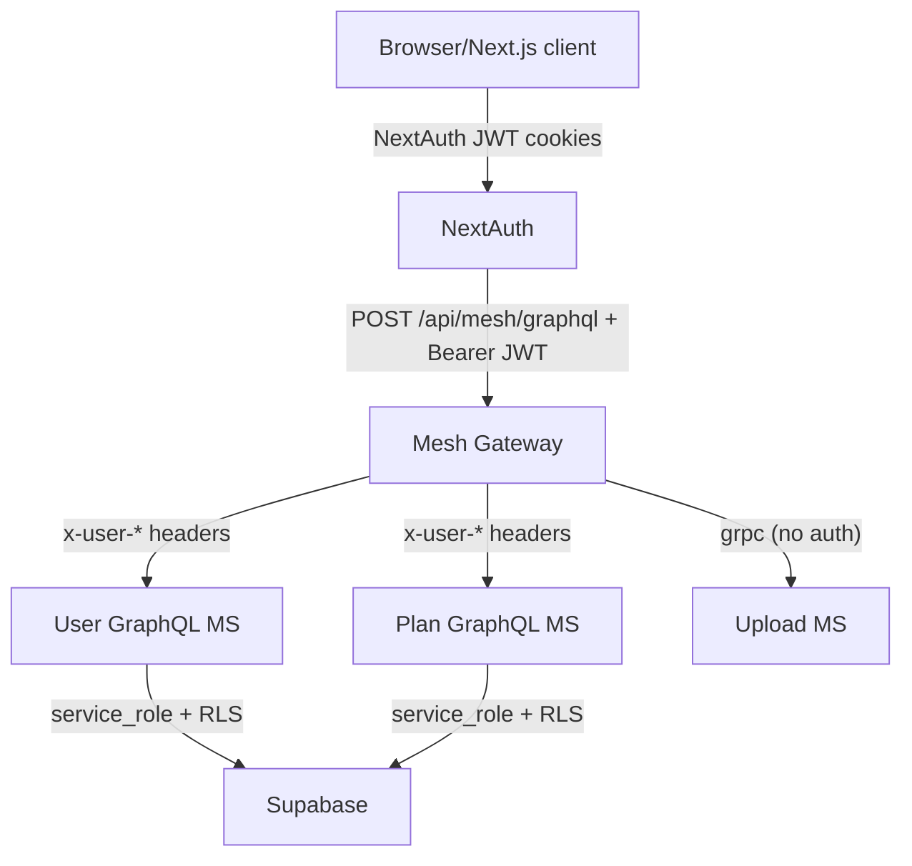

# Auth / Session / Permissions

End-to-end view of authentication, session, and access controls from the
Next.js web app through the Mesh gateway to the Nest microservices and
Supabase. Includes required cookies/headers, public vs protected surfaces,
and known gaps.

## Actors, secrets, credentials

- NextAuth (JWT sessions) using `AUTH_SECRET`; providers: Google, LinkedIn,
  GitHub (`apps/web/lib/auth/config.ts`, `apps/web/lib/auth/index.ts`).
- Mesh gateway expects Bearer JWT signed with `AUTH_SECRET` and forwards
  `x-user-*` headers to services (`apps/mesh-gateway/scripts/mesh-bootstrap.ts`,
  `apps/mesh-gateway/auth.ts`, `.meshrc.ts`).
- `x-internal-api-key` (`INTERNAL_API_KEY`) is required only by
  `user-graphql-ms` for the `upsertUser` mutation; not used elsewhere.
- Supabase uses service-role key server-side only.

## Web app (Next.js)

- Session mechanism: NextAuth JWT strategy; cookies include variations of
  `next-auth.session-token`, callback, and csrf names
  (`apps/web/lib/auth/index.ts`).
- Protected routes: middleware enforces login on `/dashboard`, `/settings`,
  `/profile` via `auth()` session check (`apps/web/middleware.ts`).
  Public: `/`, `/auth`, `/api/mesh/*`, and other routes not matched.
- Mesh proxy route[`POST /api/mesh/graphql`] AND Server-side GraphQL client: calls `auth()` to get the session - resolving auth at the entry point (route handler, server action) to avoid a Next.js pitfall - , then passes the user to `graphqlRequest()`.
- `graphqlRequest()` in `apps/web/lib/graphql/server-client.ts` signs a short-lived Bearer
  JWT with `AUTH_SECRET` (`apps/web/app/api/mesh/graphql/route.ts`).
  If no session, the request is forwarded without auth headers.
- Forwarded headers allowlist for server requests
  (`apps/web/lib/connect/forwarded-headers.ts`).

## Mesh gateway

- Listens on `MESH_GATEWAY_PORT`; no CORS restrictions at the gateway layer.
- On each request, validates Bearer JWT with `AUTH_SECRET`; if valid, injects
  `x-user-id`, `x-user-email`, `x-user-name` headers before handing to Mesh
  handler (`apps/mesh-gateway/scripts/mesh-bootstrap.ts`,
  `apps/mesh-gateway/auth.ts`).
- `.meshrc.ts` forwards these headers to downstream GraphQL sources; gRPC
  upload source has no auth (`apps/mesh-gateway/.meshrc.ts`,
  `apps/mesh-gateway/mesh.resolvers.ts`).

## Nest GraphQL services

- Global guard: `GatewayAuthGuard` requires `x-user-id` and `x-user-email`
  unless endpoint is marked `@Public()` (`packages/shared/auth`).
- CORS: both services allow origin `NEXT_PUBLIC_APP_URL` with credentials.

### plan-graphql-ms

- Public: `plans` query is `@Public()` (`apps/plan-graphql-ms/src/plan/plan.resolver.ts`).
- All other resolvers (none additional today) require `x-user-*` via guard.

### user-graphql-ms

- User queries: `user(id)` and `currentUser` require `x-user-id`; `user`
  rejects access when header id differs from requested id
  (`apps/user-graphql-ms/src/user/user.resolver.ts`).
- Experience queries/mutations require `x-user-id` header
  (`apps/user-graphql-ms/src/experience/experience.resolver.ts`).
- Internal-only: `upsertUser` is `@Public()` but additionally guarded by
  `InternalApiGuard` that checks `x-internal-api-key` equals `INTERNAL_API_KEY`
  (`apps/user-graphql-ms/src/common/guards/internal-api.guard.ts`).

### upload-ms

- Exposes only `/health` HTTP endpoint; gRPC upload watch has no auth
  (accessed via Mesh subscription).

## Supabase data layer

- Plans table: RLS allows select for everyone; modifications allowed only to
  service role (`supabase/migrations/20251203102356_create_plans_table.sql`).
- Users and experience tables: RLS enabled with deny-all policies for anon;
  app uses service-role key plus app-layer checks
  (`supabase/migrations/20260106010335_create_users_table.sql`,
  `supabase/migrations/20260109111420_create_user_experience_profile.sql`).

## Public vs protected matrix (high level)

- Web pages: `/`, `/auth` public; `/dashboard|/settings|/profile` require
  NextAuth session.
- Web API: `/api/mesh/graphql` reachable publicly; attaches Bearer JWT only
  when session exists.
- Mesh: accepts requests with or without Bearer JWT. Without JWT, downstream
  guarded resolvers fail (except `plans`).
- plan-graphql-ms: `plans` public; others guarded by `x-user-*`.
- user-graphql-ms: all resolvers need `x-user-*` except `upsertUser`, which
  needs `x-internal-api-key`.
- upload-ms: gRPC access unauthenticated; HTTP `/health` open.

## Header and cookie requirements

- Browser session: NextAuth cookies (session/callback/csrf variants).
- Web → Mesh: `Authorization: Bearer <jwt>` (signed with `AUTH_SECRET`) set
  by `/api/mesh/graphql` when session exists.
- Mesh → services: `x-user-id`, `x-user-email`, `x-user-name` injected after
  JWT validation.
- Internal-only mutation: `x-internal-api-key` for `upsertUser`.

## Gaps / risks

- Mesh gateway has no own auth/CORS; relies on downstream guards. Anyone can
  hit Mesh; only public operations succeed without JWT (e.g., `plans`).
- Upload gRPC path has no auth or tenant scoping.
- `/api/mesh/graphql` forwards unauthenticated requests; services correctly
  reject guarded operations, but consider short-circuiting earlier if needed.
- Direct access to user-graphql-ms/plan-graphql-ms is limited by CORS and
  `x-user-*` guard, but ports are accessible if reachable on the network;
  ensure deployments firewall them to internal network only.

## Flow diagram

